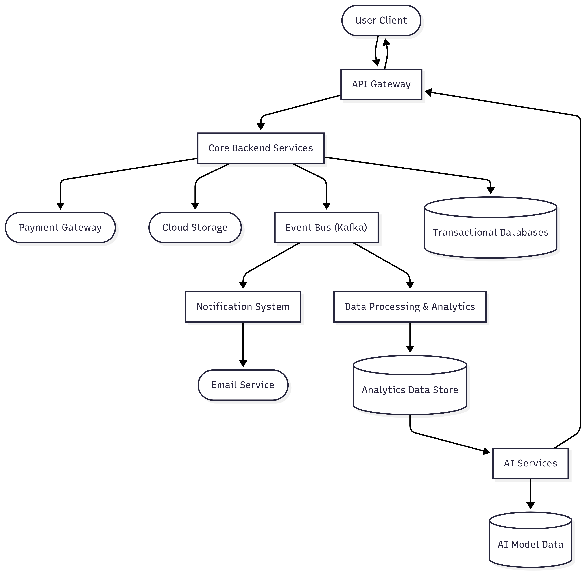

# Airbnb Backend High-Level Data Flow

This document provides a high-level overview of the data flow for a simplified Airbnb-like backend architecture. The architecture includes the main external systems, core backend processes, and data stores.

## DATA FLOW using Mermaid Diagram

## Architecture Overview

The flow focuses on these main components:

- **External Entities**
  - **User Client**: Mobile or web client used by the end user.
  - **Payment Gateway**: Third-party payment processor for handling transactions.
  - **Email Service**: Service for transactional or marketing emails.
  - **Cloud Storage**: Used for storing static assets such as images and documents.

- **Processes**
  - **API Gateway**: Entry point for client requests, handling routing, throttling, and security.
  - **Core Backend Services**: Main business logic, including user, booking, and property management.
  - **Event Bus (Kafka)**: Asynchronous messaging to decouple services.
  - **Data Processing & Analytics**: Batch or stream processing for metrics and insights.
  - **AI Services**: Recommendations and personalization models.
  - **Notification System**: Triggers email and push notifications based on events.

- **Data Stores**
  - **Transactional Databases**: Store operational data such as user, booking, and listing records.
  - **Analytics Data Store**: Stores aggregated or processed analytics data.
  - **AI Model Data**: Stores trained models and features for recommendations.

## Data Flow Description

The high-level data flow follows these steps:

1. The **User Client** sends requests to the **API Gateway**.
2. The **API Gateway** forwards the requests to **Core Backend Services**.
3. The **Core Backend Services** persist transactional data in **Transactional Databases**.
4. Core events are pushed to the **Event Bus (Kafka)**.
5. The **Event Bus** triggers **Data Processing & Analytics**, which writes to the **Analytics Data Store**.
6. The **Analytics Data Store** feeds data to **AI Services**, which also uses **AI Model Data**.
7. The **AI Services** return results to the **User Client** via the **API Gateway**.
8. The **Event Bus** also routes events to the **Notification System**, which delivers notifications via the **Email Service**.
9. The **Core Backend Services** directly integrate with the **Payment Gateway** to process transactions and use **Cloud Storage** for asset storage.
