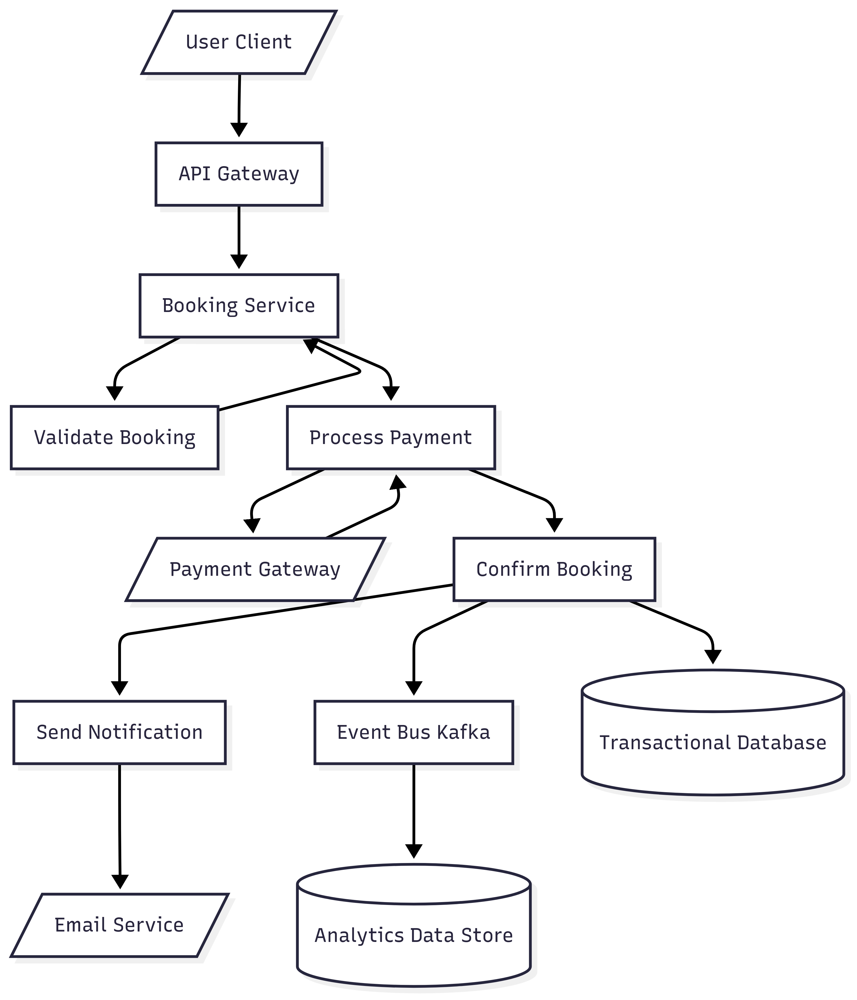

# Airbnb Backend - Property Booking Flow

This document provides a detailed overview of the **Property Booking** process for an Airbnb-like backend architecture, describing how booking requests are validated, processed, persisted, and communicated to other systems.

## Booking Process Overview

The booking workflow includes the following high-level steps:

1. **User Client** initiates a booking request through the app or website.
2. The request passes through the **API Gateway** to reach backend services.
3. The **Booking Service** handles booking-related business logic.
4. Booking validation is performed to ensure:
   - The property is available.
   - The user is eligible.
   - Pricing is correct.
5. Payment is processed via the **Payment Gateway**.
6. Upon successful payment, the booking is confirmed and stored in the transactional database.
7. A notification is sent to the user to confirm the booking (via email or push notification).
8. The booking event is published on the **Event Bus (Kafka)** for asynchronous downstream consumers (such as analytics, host notifications, or recommendation engines).
9. Analytics services consume these events to track performance and user behavior.

## Mermaid Flowchart
Below is the Mermaid diagram representing this booking process:
