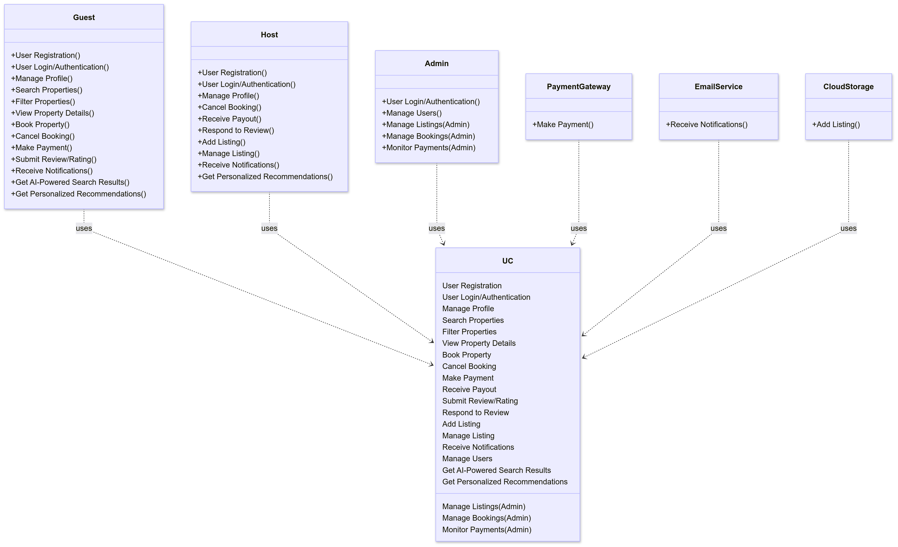

# Airbnb Clone Backend (Microservices & AI-Powered)

-----

##  Project Overview

This project is an ambitious, enterprise-scalable backend for an Airbnb-like rental marketplace. Developed as a key component of a professional portfolio, it showcases a robust **microservices architecture** seamlessly integrated with **Big Data** capabilities and **AI-powered features** such as personalized search and ad listings.

The core objective is to simulate a real-world, high-traffic application, demonstrating proficiency in scalable system design, secure API development, asynchronous communication, and intelligent data processing.

##  Use Case Diagram: System Interactions

This Use Case Diagram provides a high-level overview of how various users (actors) interact with the Airbnb Clone Backend system and its core functionalities. It illustrates the primary functional requirements from the perspective of different stakeholders.

### **Summary of System Interactions:**

The diagram illustrates the primary roles and their interactions:

  * **Guests** can register, log in, manage their profiles, search and filter properties (enhanced by **AI-Powered Search**), view details, book properties (which includes **Making Payments**), cancel bookings, submit reviews, and receive notifications. They also benefit from **Personalized Recommendations**.
  * **Hosts** can also register, log in, manage their profiles, add and manage their property listings, receive payouts from bookings, respond to reviews, and receive notifications. They also get **Personalized Recommendations** for potential guests or listing improvements.
  * **Admins** are responsible for high-level management: controlling users, listings, bookings, and monitoring payments to ensure platform integrity.
  * **External Systems** like `Payment Gateway`, `Email Service`, and `Cloud Storage` represent essential third-party integrations that facilitate core functionalities like payments, notifications, and media storage.

This diagram clearly depicts the functional scope of the backend, demonstrating how different user types engage with the system's capabilities, including the integrated AI features, and highlighting key dependencies on external services.

